## PRE-REQUISITES (Before Installing AD)
### Installing Windows Server 2022

### Set a Static IP 
Open PowerShell and type : `ipconfig /all`
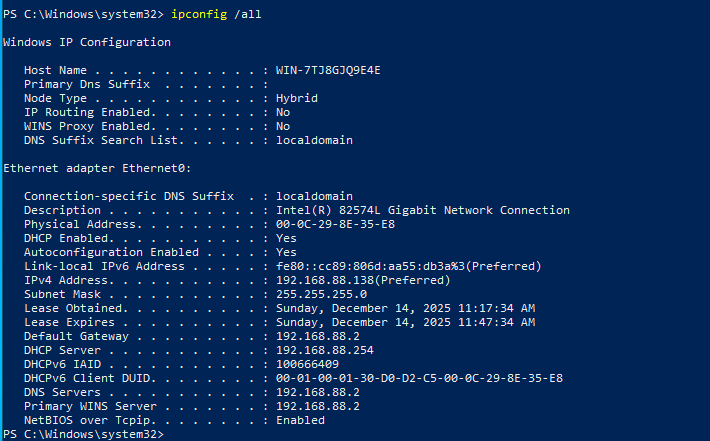
- Note your **IPv4 Address**, **Subnet Mask**, and **Default Gateway**.

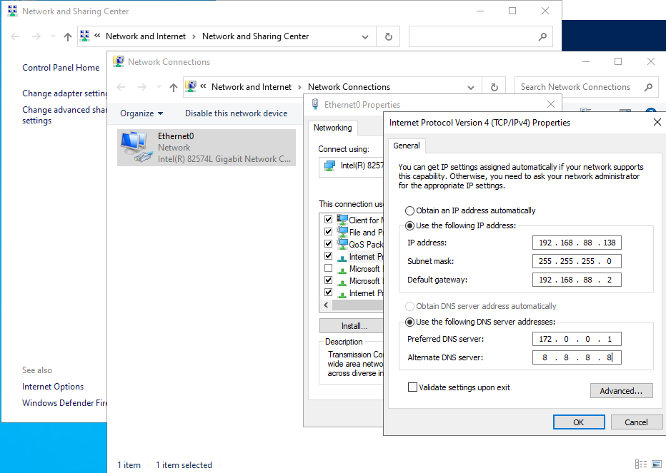
- Note your **IPv4 Address**, **Subnet Mask**, and **Default Gateway**.
- Go to **Control Panel** > **Network and Internet** > **Network Connections**.
- Right-click your adapter > **Properties** > **IPv4** > **Properties**.

Use the IP address of the automatically allocated , and click Ok :
- **IP Address:** `192.168.88.138`
- **Subnet Mask:**  `255.255.255.0`.
- **Gateway:** `192.168.88.2`
- **Preferred DNS Server:** **127.0.0.1** (The DC must point to itself for DNS).
- **Alternate DNS:** `8.8.8.8` (Google, for internet access).

### Rename the Server
- We change the Computer Name to `DC01`.

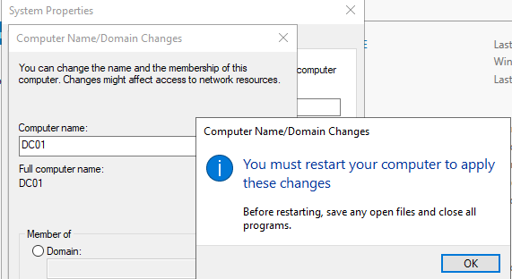
## Install & PROMOTE
### Install the AD DS Role
- Click **Manage** (top right) > **Add Roles and Features**.
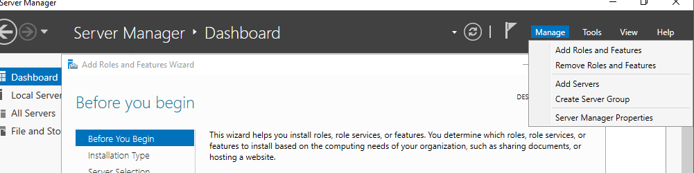

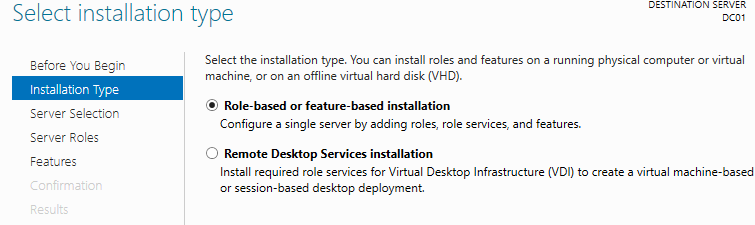

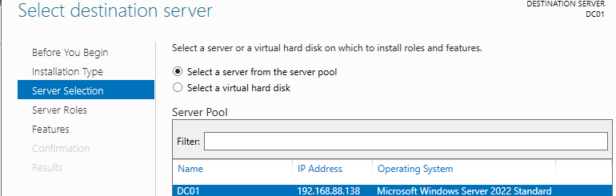
- On Server Roles : Check **Active Directory Domain Services**. 
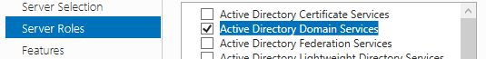
- Click Add Features.
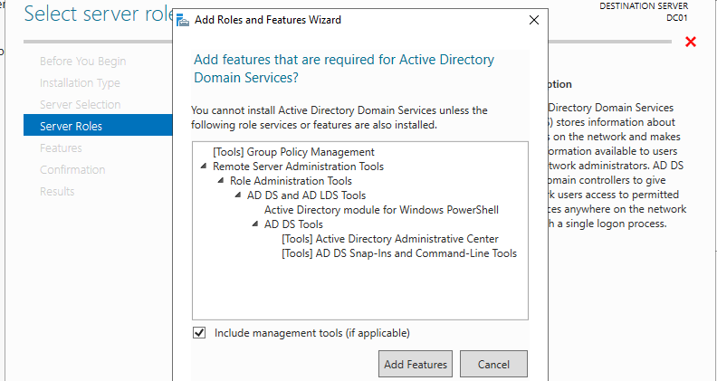
- Click Next all the way to Confirmation.
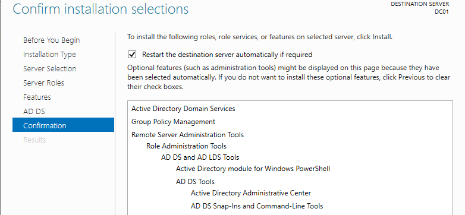
- Install it an wait for the installation to finish.

### Promote to Domain Controller
To promote the server to domain controller there is 2 option :
- Click it here after installation :
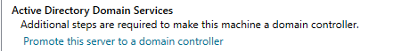
- On the yellow triangle, at the top right flag icon. Click it
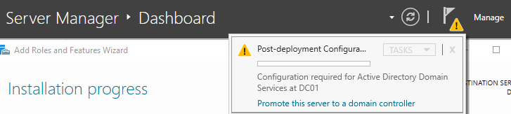
- Select: **Add a new forest** , and write the root domain name `lab.local`

- Then on Domain Controller Options : 
	- Leave Forest/Domain functional level at Windows Server 2016, to ensure compatibility.
	- Type a DSRM Password, that help boot into **Safe Mode**.
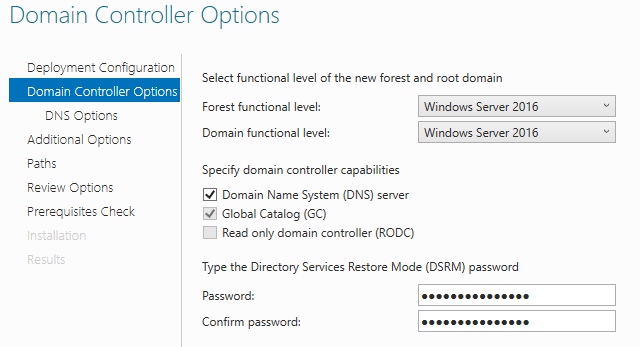
- Ignore the yellow warning
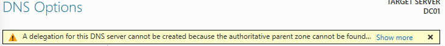
- **Additional Options:** Verify NetBIOS name is `LAB`
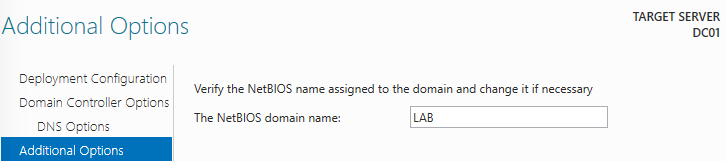
- **Paths:** Leave defaults.
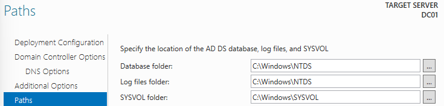
- **Prerequisites Check:** Wait for the green checkmark.
We got 2 problem , 1 which is critical :
- The Administrator password is blank 
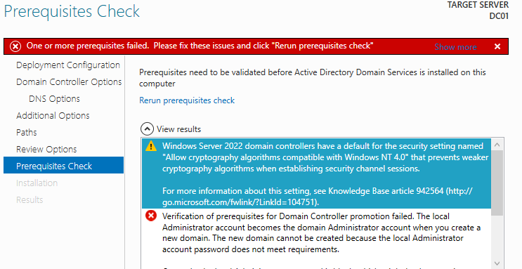
- So we set a password 
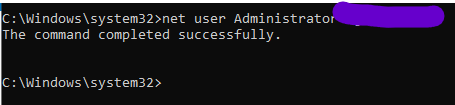
- The click **Rerun Prerequisites Check**, and we get the green checkmark.
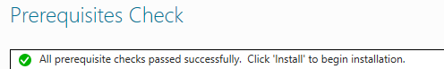
- Click **Install** to begin installation.
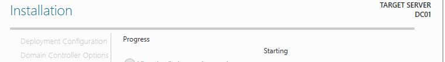
- The server will reboot automatically. 
## VERIFICATION
### Login & Verify
- When it comes back up, the login screen should say: `LAB\Administrator`.
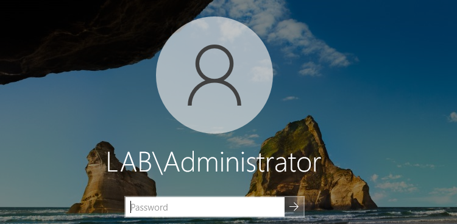
- Login.
- Open **Server Manager** > **Tools** (top right) and verify you see **Active Directory Users and Computers**.
	- Open it. You should see your domain `lab.local`.
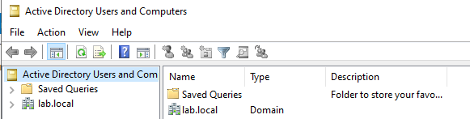
## Disclaimer 
For the 2 warning we got at the installation :
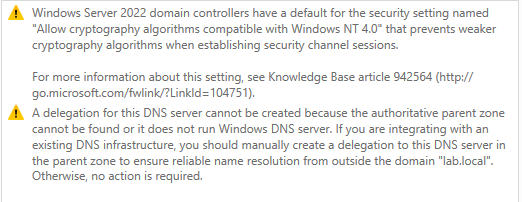
- **The Cryptography Warning:** Means your server is too modern for computers from 1996. **Ignore it.**
- **The DNS Warning:** Means "I cannot find a parent company above you." This is correct because you _are_ the parent company. **Ignore it.**