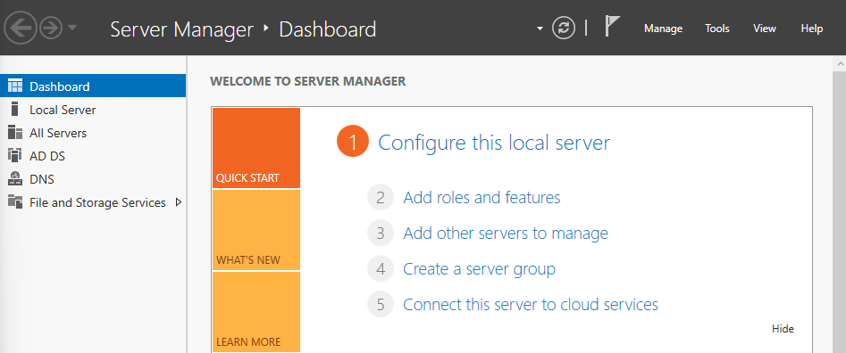
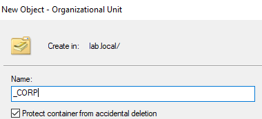
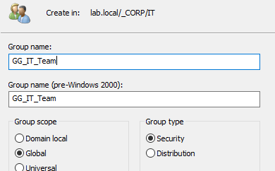
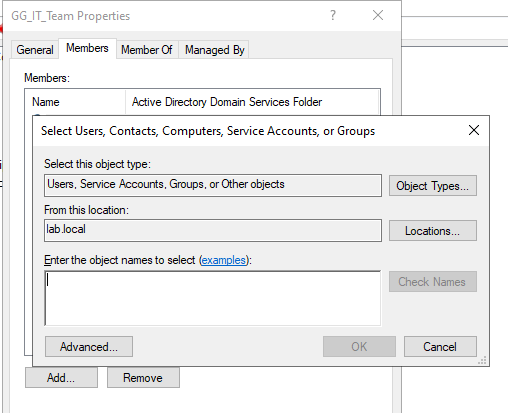

# Day 2: Identity Architecture & User Provisioning

## 1. Project Overview
**Objective:** Establish the organizational hierarchy (OU) and Role-Based Access Control (RBAC) foundation for the domain.
**Scope:** Design department structure, create security groups, and provision initial staff accounts.

## 2. Tool Access
Management performed via **Active Directory Users and Computers (ADUC)** on `DC01`.

## 3. OU Architecture Design
**Strategy:** Avoid the default "Users" container. Implemented a hierarchical Organizational Unit (OU) structure to separate permissions by department.

* **Root:** `_CORP` (Underscore ensures visibility at top).

* **Sub-OUs:**
    * `IT` (Technical Administrators)
    * `HR` (Human Resources)
    * `Finance` (Financial Operations)

## 4. RBAC Group Strategy
Implemented **Global Security Groups** to manage permissions efficiently, adhering to the "User -> Group -> Resource" model.

| OU | Group Name | Scope | Type |
| :--- | :--- | :--- | :--- |
| **IT** | `GG_IT_Team` | Global | Security |
| **HR** | `GG_HR_Staff` | Global | Security |
| **Finance** | `GG_Finance_Staff` | Global | Security |

## 5. User Provisioning
**Naming Convention:** `FirstInitial.LastName` (e.g., `s.admin`).
**Security Control:** All new accounts set to **"User must change password at next logon"**.

### Provisioned Accounts
* **IT:** `s.admin` (System Admin), `y.tech` (Support)
* **HR:** `h.manager` (Director), `s.recruit`, `k.payroll`, `l.admin`
* **Finance:** `f.director` (CFO), `o.account`, `n.audit`, `d.billing`

## 6. Access Assignment
Users were added to their respective Global Groups to ensure correct inheritance of future permissions.

* **Action:** `s.admin` added to `GG_IT_Team`.
* **Validation:** Verified "Member Of" tab for key users.

---
*Verified by: Saad Charif | Date: Dec 20, 2025*