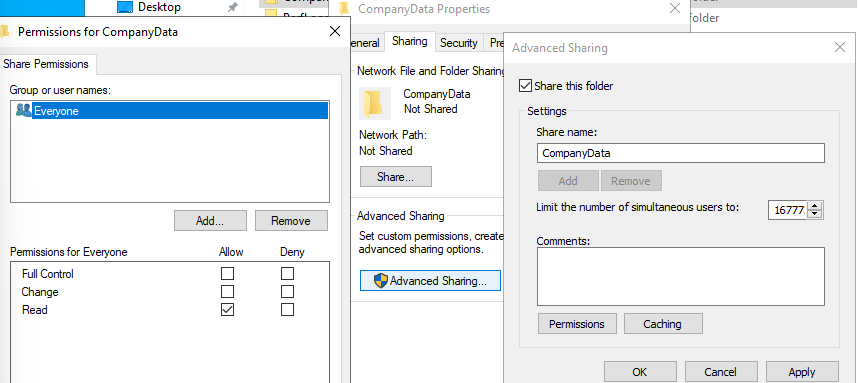
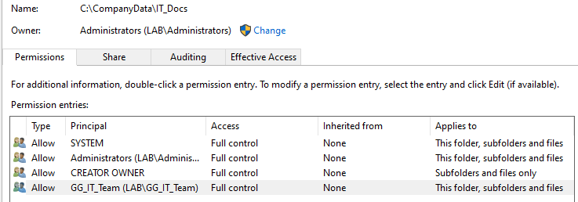
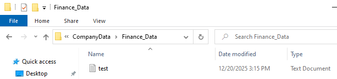
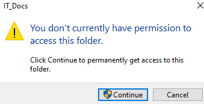

# Day 3: Data Security & Access Control (NTFS)

## 1. Project Overview
**Objective:** Secure the corporate file server (`\\DC01\CompanyData`) using the Principle of Least Privilege.

**Method:** Implemented a split-permission model: "Open" Share permissions combined with "Restrictive" NTFS permissions.

## 2. Shared Folder Architecture
A centralized data repository was created on the Domain Controller (`DC01`).

* **Root Share:** `CompanyData`
* **Sub-directories:** `IT_Docs`, `HR_Files`, `Finance_Data`

### Share Configuration (The Gateway)
Followed the Microsoft "Golden Rule":
* **Share Permissions:** `Domain Users` set to **Full Control**.
* **Reasoning:** This prevents "double-locking." We leave the front door open and lock specific rooms using NTFS.

## 3. NTFS Permission Hardening
Inheritance was disabled on all sensitive sub-folders to remove generic `Users` access. Access was granted explicitly to Departmental Global Groups.

### A. HR Department Security
* **Target:** `HR_Files`
* **Access Rule:** Only HR Staff can modify; IT can manage.
* **Configuration:**
    * **Inheritance:** Disabled (Converted to explicit).
    * **Principals:** `GG_HR_Staff` (Modify), `GG_IT_Team` (Full Control).
    * **Removed:** `BUILTIN\Users`.

### B. Finance & IT Security
Applied similar logic to remaining departments, ensuring strict isolation.

* **Finance:** `GG_Finance_Staff` granted Modify access.
* **IT Docs:** Strict lockdown. ONLY `GG_IT_Team` has access. Even other administrators are restricted by process.

## 4. Operational Challenges & Resolution
**Incident:** During verification, the test user `f.director` was unable to sign in to the Domain Controller console.
**Error:** *"The sign-in method you're trying to use isn't allowed."*

**Root Cause:** The default Domain Controller Security Policy blocks standard users from interactive (local) logon.
**Resolution:**
1.  Accessed **Group Policy Management**.
2.  Edited `Default Domain Controllers Policy`.
3.  Navigate to: `Local Policies` > `User Rights Assignment`.
4.  Modified **"Allow log on locally"** to include `Domain Users`.
5.  Executed `gpupdate /force`.

## 5. Verification (User Simulation)
Conducted penetration testing masquerading as user `f.director` (Finance Director).

| Test Case | Target Folder | Expected Result | Actual Result | Status |
| :--- | :--- | :--- | :--- | :--- |
| **Authorized Access** | `Finance_Data` | Create File Allowed | File Created | ✅ Pass |
| **Unauthorized Access** | `IT_Docs` | Access Denied | Popup Triggered | ✅ Pass |
| **Unauthorized Access** | `HR_Files` | Access Denied | Popup Triggered | ✅ Pass |

### Evidence of Enforcement
**Success:** User creating file in Finance folder.

**Block:** User denied access to IT folder.

---
*Verified by: Saad Charif | Date: Dec 20, 2025*