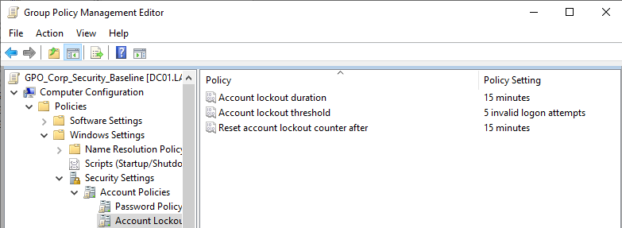
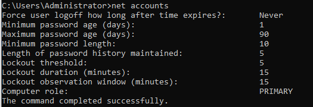

# Day 4: Global Security Policy & Hardening

## 1. Project Overview
**Objective:** Implement a domain-wide Identity Security Baseline to mitigate credential theft and brute-force attacks.
**Scope:** Password complexity enforcement and automated account lockout policies.

## 2. Policy Strategy
Instead of modifying the *Default Domain Policy* (which is hard to restore), I deployed a dedicated GPO named **`GPO_Corp_Security_Baseline`**.

### Configuration Standards (NIST/CIS Aligned)
| Policy Setting | Value | Security Benefit |
| :--- | :--- | :--- |
| **Min Password Length** | 10 Characters | Increases entropy against rainbow table attacks. |
| **Complexity** | Enabled | Forces Uppercase, Lowercase, Number, Symbol. |
| **History** | 5 Passwords | Prevents users from cycling standard passwords. |
| **Lockout Threshold** | 5 Attempts | Blocks automated brute-force scripts immediately. |
| **Lockout Duration** | 15 Minutes | Balances security vs. Help Desk ticket volume. |

## 3. Implementation Challenges
**Issue:** After linking the GPO, the `net accounts` verification command showed the old settings (Length: 7) instead of the new ones (Length: 10).
**Root Cause:** **GPO Precedence.** The *Default Domain Policy* was listed as Link Order #1, overriding my new security baseline.
**Resolution:**
1.  Opened Group Policy Management > Inheritance Tab.
2.  Promoted `GPO_Corp_Security_Baseline` to **Link Order 1**.
3.  Executed `gpupdate /force`.

## 4. Final Verification
Validated the active password policy on the Domain Controller using the command line.

**Command:** `net accounts`
**Result:** Confirmed minimum length is **10** and lockout threshold is **5**.

---
*Verified by: Saad Charif *