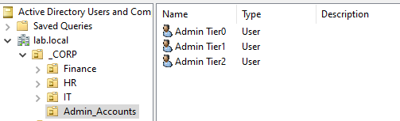
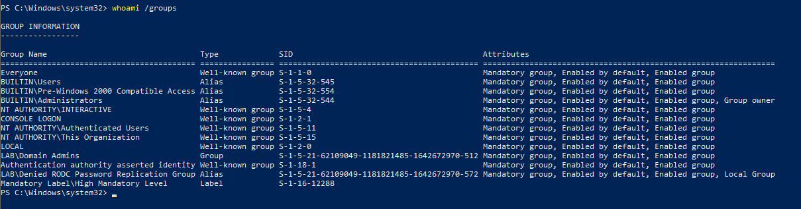

# Privileged Access Management (PAM) Architecture

## 1. Project Overview
**Objective:** Architect a "Tiered Administration Model" (Microsoft Enterprise Access Model) to prevent privilege escalation and credential theft.
**Scope:** Segregation of high-privilege credentials based on asset sensitivity (Identity vs. Server vs. Workstation).

## 2. Security Context (Why this matters)
In flat AD environments, a single "Domain Admin" often logs into infected workstations. This allows attackers to dump credentials (using Mimikatz) and compromise the entire domain.
**My Solution:** Strict credential isolation. High-privilege accounts (Tier 0) are never exposed to lower-trust assets (Tier 2).

## 3. The Tiered Model Design

| Tier Level | Asset Scope | Account Name | Role / Privilege |
| :--- | :--- | :--- | :--- |
| **Tier 0** | **Identity Plane** (Domain Controllers, PKI) | `adm.tier0.sys` | **Domain Admin**. The "Keys to the Kingdom." Used ONLY on DC01 console. |
| **Tier 1** | **Server Plane** (App, File, Database) | `adm.tier1.sys` | **Server Admin**. Managed via group `GG_Tier1_Server_Admins`. |
| **Tier 2** | **Workstation Plane** (Windows 10/11) | `adm.tier2.sys` | **Workstation Admin**. Used for Help Desk & End-user support. |
| **User** | **Productivity** (Email, Web, Office) | `s.admin` | **Standard User**. 0% Administrative Privilege. |

## 4. Implementation Details
1.  **OU Isolation:** Created a protected Organizational Unit `Admin_Accounts` to separate privileged identities from standard users.
2.  **RBAC Groups:** Established `GG_Tier1` and `GG_Tier2` groups to assign rights dynamically rather than individually.
3.  **GPO Enforcement:** Modified the "Allow log on locally" policy to ensure only authorized Tier 0 personnel can sign in to the Domain Controller.

## 5. Verification
Logged in as the Tier 0 administrative account and validated group membership.
* **Command:** `whoami /groups`
* **Result:** Confirmed membership in `LAB\Domain Admins`.

---
*Verified by: Saad Charif*