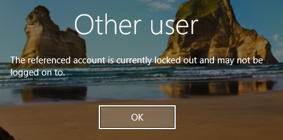
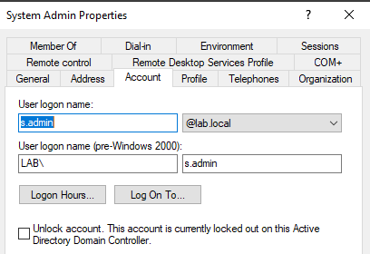
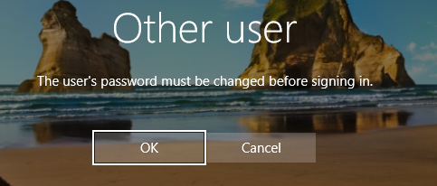
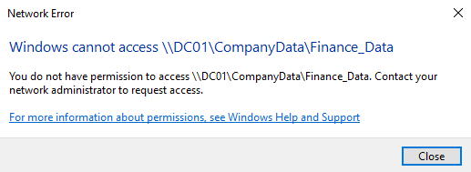

# Incident Response & Operational Workflows

## 1. Overview
**Objective:** Validate security controls (GPO, NTFS) by simulating common L1/L2 support tickets.

**Role:** Acting as IT Operations Support resolving user incidents.

**Scope:** Identity lifecycle management and access troubleshooting.

## 2. Incident Log

### 🎫 Ticket #101: Account Lockout (Security Verification)
**Reporter:** `s.admin`
**Issue:** User unable to login. Error: "The referenced account is currently locked out."

**Root Cause:** User exceeded the 5-attempt threshold configured in `GPO_Corp_Security_Baseline`.

**Resolution:**
1. Verified identity of user.
2. Unlocked account via ADUC > Account Tab.
3. Verified user could login successfully.

**Evidence:**

---

### 🎫 Ticket #102: Password Reset Request
**Reporter:** `h.manager` (HR Director)
**Issue:** Forgotten password.
**Security Protocol:**
1. Admin reset password to temporary value.
2. **Enforced** "User must change password at next logon" to maintain non-repudiation (Admin never knows the real password).

**Verification:** System forced a password change prompt immediately upon login.

**Evidence:**

---

### 🎫 Ticket #103: Access Denied Investigation
**Reporter:** `h.manager`
**Issue:** Unable to open `\\DC01\CompanyData\Finance_Data`.
**Investigation:**
* Checked NTFS Permissions for `Finance_Data` folder.
* **Findings:** Folder is restricted strictly to `GG_Finance_Staff`.
* **Conclusion:** User `h.manager` is a member of `GG_HR_Staff`. Access is correctly denied by the Least Privilege design.

**Action:** Ticket closed as "Working as Designed."

**Evidence:**

## 3. Operational Summary
* **GPO Effectiveness:** Confirmed Lockout Policy triggers exactly at 5 attempts (Anti-Brute Force active).
* **NTFS Effectiveness:** Confirmed Lateral Movement protection between HR and Finance is active.
* **Support Workflow:** Validated secure password reset procedures (forcing change on next logon).

---
*Verified by: Saad Charif*