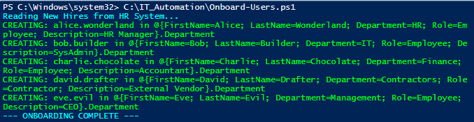
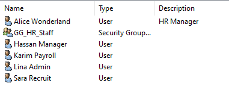
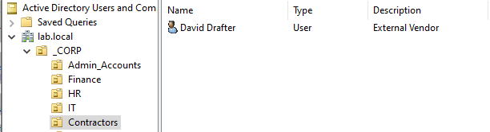
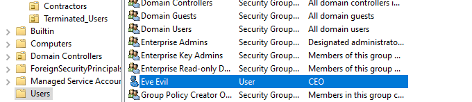
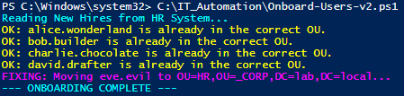

# Automated Identity Provisioning

## 1. Automation Overview
**Objective:** Eliminate manual user creation to reduce human error and ensure standardization.
**Tool:** PowerShell Script `Onboard-Users.ps1`.
**Input:** CSV Data Feed mimicking an HR Information System (HRIS).

## 2. Script Logic Flow
The script follows this JML decision tree:
1.  **Import Data:** Reads `NewHires.csv`.
2.  **Generate ID:** Formats username as `firstname.lastname`.
3.  **Determine Scope:** Matches "Department" column to AD Organizational Unit (OU).
4.  **Provision:**
    * Creates AD Object.
    * Sets temporary password.
    * Enforces "Change on Next Logon".
5.  **Assign Access:** Adds user to the correct Department Security Group.

## 3. Execution Evidence
Executed the onboarding script for a batch of 5 new employees.

*(Screenshot of ADUC showing Alice in HR)*

*(Screenshot of ADUC David in Contractors)*

## 4. "Failure Lab" Observation
**Incident:** User `Eve Evil` (Management Dept) was processed but not placed in a specific OU.

**Root Cause:** The script's `if/elseif` logic did not have a defined rule for "Management."

**System Behavior:** The script triggered the `else` "Safety Net" clause and dumped the user in the default container.

**Fix Required:** Update JML Logic Matrix to include Executive Management rules.

## 5. Remediation & Code Evolution
**Constraint:** The AD Architecture strictly defines `HR`, `Finance`, and `IT` OUs. No new "Management" OU is permitted.

### Phase 1: Logic Patch (Mapping Rule)
**Problem:** The original script (V1) had no rule for `Department = Management`, causing User `Eve Evil` to fall into the default `CN=Users` container.
**Fix:** Implemented a **Transformation Rule** in the PowerShell logic.
* **New Logic:** `If Department == 'Management', Map to 'HR' OU`.
* **Reasoning:** Executives require higher confidentiality, aligning best with HR security policies.

### Phase 2: State Repair (Idempotency)
**Problem:** Simply updating the mapping logic did not fix the *existing* user who was already in the wrong folder.
**Fix:** Upgraded script to Version 2.0 with **Self-Healing Logic**.
* **Old Behavior:** If user exists, skip.
* **New Behavior:** If user exists, **check location**. If location is wrong, **move object**.

**Verification:**
Re-executed the V2 script. The console output confirmed the auto-remediation:

1. Detected `Eve Evil` in the incorrect `CN=Users` location.
2. Automatically executed `Move-ADObject` to migrate the account to `_CORP\HR`.

---
*Scripted by: Saad Charif | Date: Dec 2025*