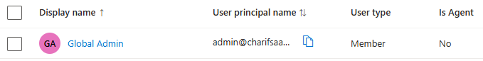
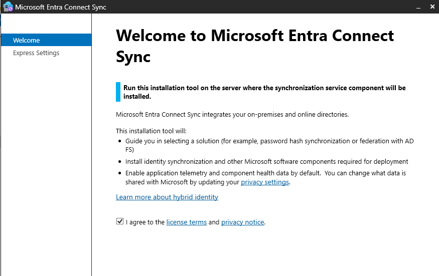
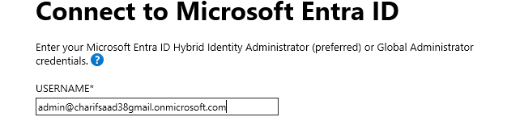
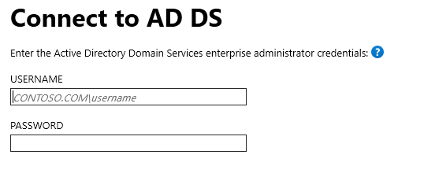
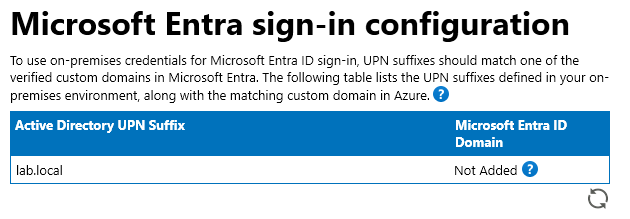
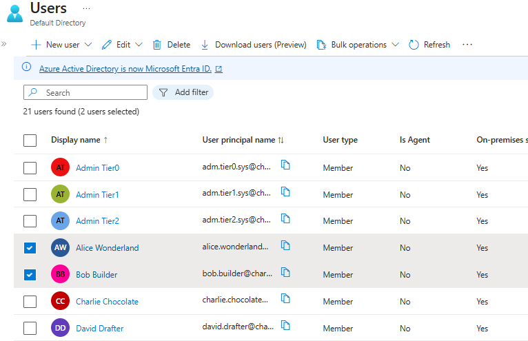

# Hybrid Identity Configuration

## 1. Project Overview
**Objective:** Establish a Hybrid Identity environment by synchronizing on-premises Active Directory (AD DS) users to Microsoft Entra ID (formerly Azure AD).
**Goal:** Enable "Single Identity" where users (`Alice`, `Bob`) use their local credentials to access cloud resources.
**Technology Stack:**
* **Source:** Windows Server 2019 AD (`lab.local`)
* **Destination:** Microsoft Entra ID Tenant (`charifsaad38gmail.onmicrosoft.com`)
* **Bridge:** Microsoft Entra Connect (V2)

## 2. Implementation Strategy
I utilized **Microsoft Entra Connect** with **Password Hash Synchronization (PHS)**.
* **Why PHS?** It allows users to authenticate to the cloud without the cloud needing to query the on-premises server for every login. It is the most robust deployment for a lab environment.
* **Sync Scope:** Synchronized the `_CORP` Organizational Unit (OU) to ensure only legitimate employees are replicated.

## 3. Step-by-Step Configuration

### Step 1: Cloud Tenant Preparation
**Status:** Utilized existing Azure Free Account tenant.
* **Tenant Domain:** `charifsaad38gmail.onmicrosoft.com`
* **Admin Account:** Created a dedicated Global Administrator (`admin`) to decouple the sync engine from personal credentials.

### Step 2: Entra Connect Installation
I installed the synchronization engine on `DC01` using **Express Settings**.
* **Privileges:** Ran installer with Enterprise Admin rights.
* **Configuration:** Automatically enabled Password Hash Sync.

### Step 3: Establishing the Connection
The bridge requires authentication on both sides of the identity boundary.

**A. Connect to Entra ID (Cloud)**
Using the dedicated `Global Admin` account created in Step 1.

**B. Connect to AD DS (On-Premises)**
Using the Tier 0 Enterprise Admin account (`LAB\adm.tier0.sys`).

**C. Handling Domain Conflicts**
* **Issue:** The local domain `lab.local` is not routable on the public internet.
* **Resolution:** Configured the sync engine to "Continue without matching all UPN suffixes."

## 4. Verification & Results
**Status:** **SUCCESS**

**Validation Steps:**
1.  Initiated full synchronization cycle.
2.  Logged into **Entra Admin Center**.
3.  Verified user objects appeared with **"On-premises sync enabled"** set to **"Yes"**.

**Evidence:**
Users `Alice Wonderland` and `Bob Builder` are now visible in the Cloud.

---
*Configuration by: Saad Charif*